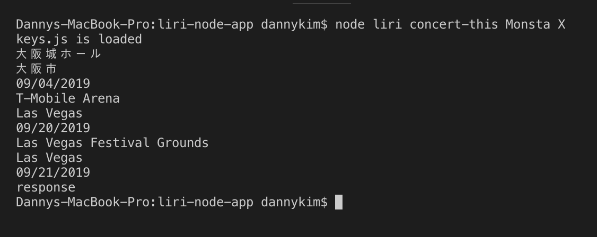
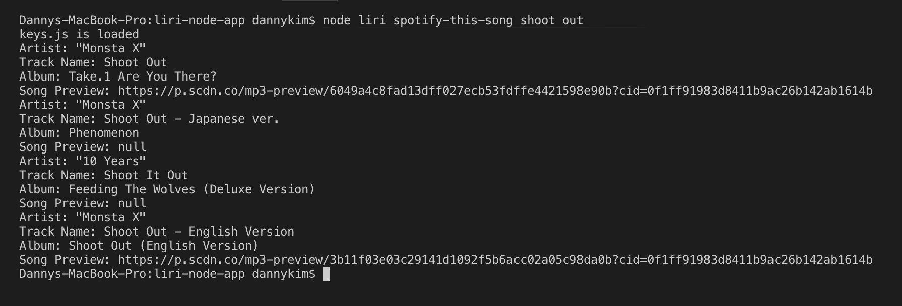
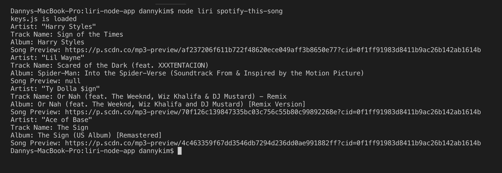
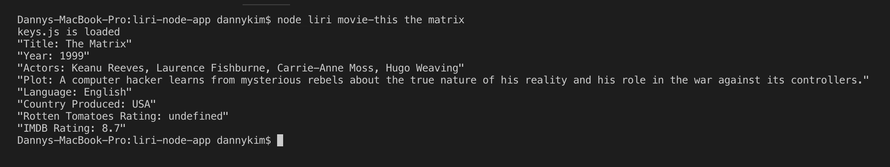
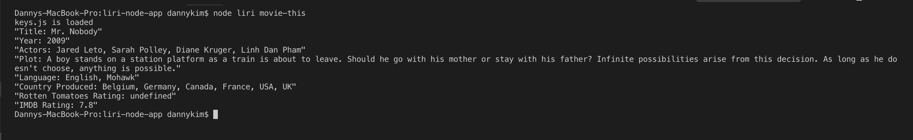
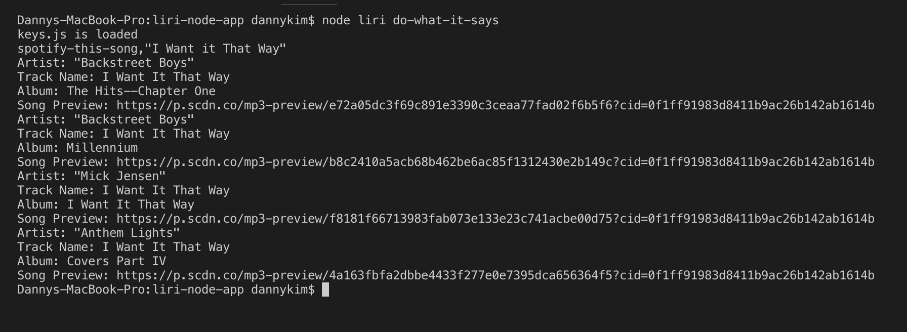

# LIRI

### Overview

"LIRI", or Language Interpretation and Recognition Interface, is a Node.js command line application that takes user's input and provides requested data.

Taking after her iOS relative called "SIRI", LIRI can accept commands with slight, syntactic similarity to human language.

### How to Use

1. Run the app in Git Bash or Terminal by writing your command in the following syntax:

   node liri <_COMMAND_> <_SEARCH TERM_>

2. Commands avaiable are:

   - `concert-this`

   - `spotify-this-song`

   - `movie-this`

   - `do-what-it-says`

3. What each command does:

   1. `node liri.js concert-this <artist/band name here>`

   - This will search the Bands in Town Artist Events API (`"https://rest.bandsintown.com/artists/" + artist + "/events?app_id=codingbootcamp"`) for an artist and render the following information about each event to the terminal:

     - Name of the venue
     - Venue location
     - Date of the Event



2.  `node liri.js spotify-this-song '<song name here>'`

- This will show the following information about the song in your terminal/bash window

  - Artist(s)
  - The song's name
  - A preview link of the song from Spotify
  - The album that the song is from
    

  - If no song is provided then your program will default to "The Sign".
    

3.  `node liri.js movie-this '<movie name here>'`

- This will output the following information to your terminal/bash window:

```
* Title of the movie.
* Year the movie came out.
* IMDB Rating of the movie.
* Rotten Tomatoes Rating of the movie.
* Country where the movie was produced.
* Language of the movie.
* Plot of the movie.
* Actors in the movie.
```



- If the user doesn't type a movie in, the program will output data for the movie 'Mr. Nobody.'
  

4.  `node liri.js do-what-it-says`

- Using the `fs` Node package, LIRI will take the text inside of random.txt and then use it to call one of LIRI's commands.

- It will `spotify-this-song` for "I Want it That Way," as follows the text in `random.txt`.



### Components

- [Node.js](https://nodejs.org/en/)
- [Axios](https://www.npmjs.com/package/axios)
- [Spotify API](https://www.npmjs.com/package/node-spotify-api)
- [OMDB API](http://www.omdbapi.com)
- [Bands In Town API](http://www.artists.bandsintown.com/bandsintown-api)
- [Moment](https://www.npmjs.com/package/moment)
- [DotEnv](https://www.npmjs.com/package/dotenv)
